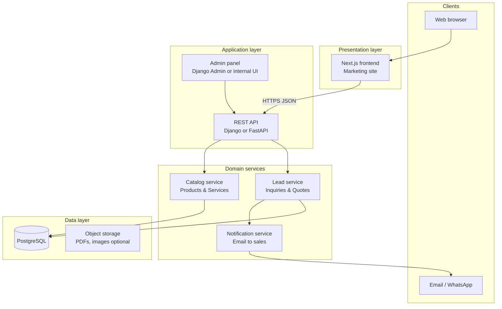
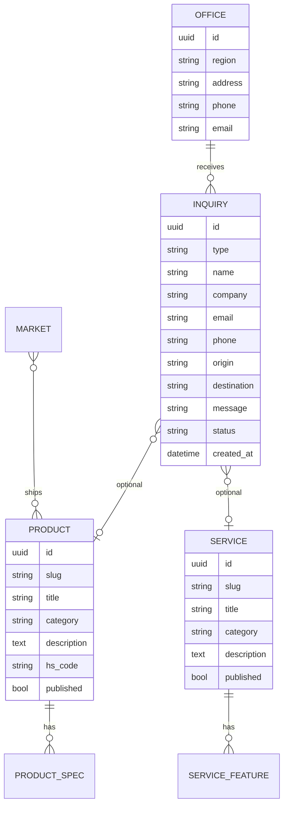
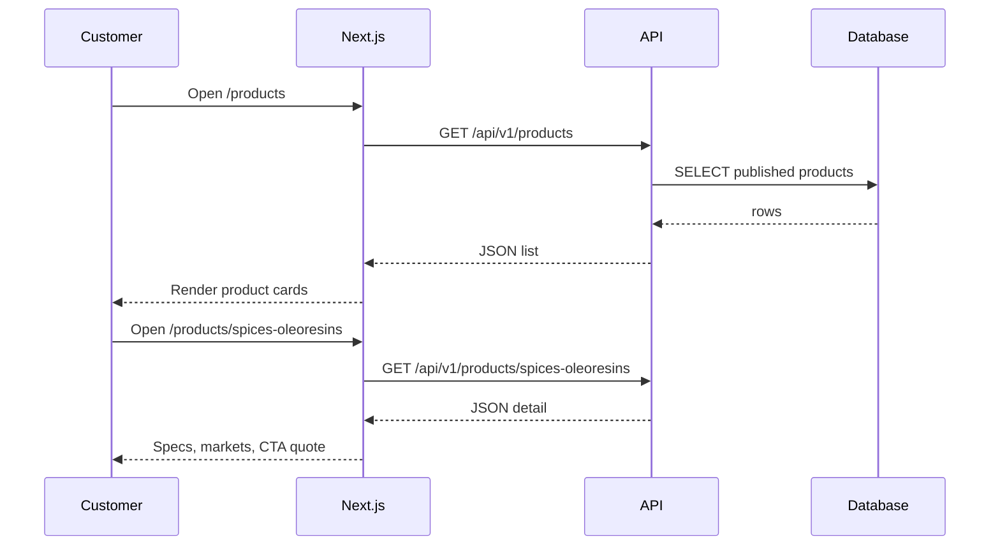
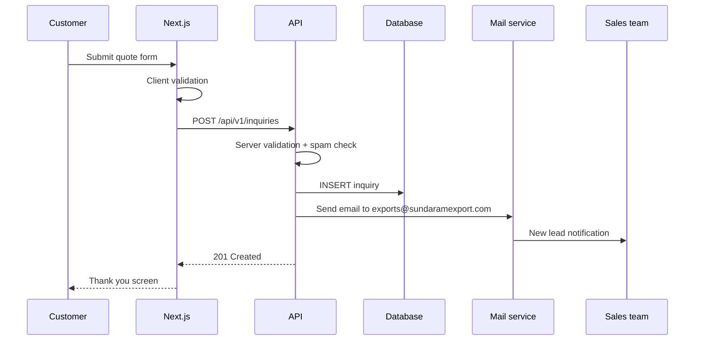
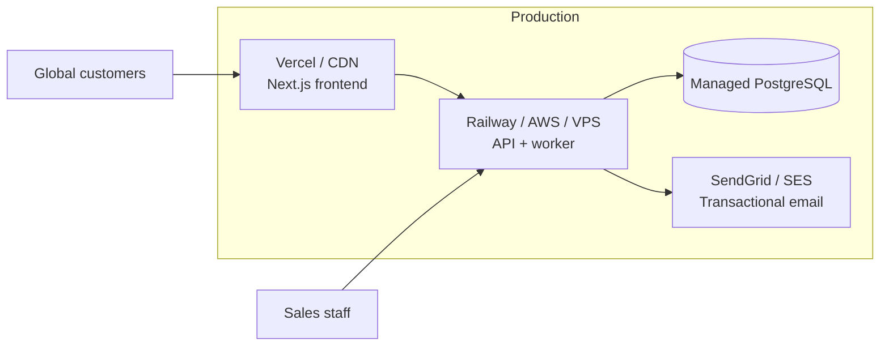

# Sundaram Export — Architecture & System Design

This document describes the **current system**, the **target architecture** for a multinational export company web app, and a **phased plan** that keeps the first version simple: show products and services, then let customers contact you when they want to export.

---

## 1. Business goal (what the app does)

| Actor | Goal |
|-------|------|
| **Customer / buyer** | Discover what you export (products) and what you provide (logistics & trade services), then reach out for a quote or partnership. |
| **Your company** | Present a professional multinational brand, capture qualified leads, and follow up offline (email, phone, CRM). |

**Core rule for v1:** The website is a **catalog + lead generation** system — not a shopping cart, not self-service booking, not payment online.

```
Customer journey (v1)

  Landing → Browse Products / Services → Read details → Contact or Request Quote → Your sales team responds
```

---

## 2. Current state (as built today)

### 2.1 Repository layout

```
Sundaram Export/
├── frontend/                 # Next.js 16 public website (only app today)
│   └── src/
│       ├── app/              # Routes (pages)
│       ├── components/       # UI (header, cards, forms)
│       ├── data/             # Static TypeScript content (mock CMS)
│       └── lib/
└── docs/
    └── ARCHITECTURE.md       # This file
```

There is **no backend API or database yet**. Content lives in `frontend/src/data/*.ts`. Forms show a success message but do not persist data.

### 2.2 Current routes

| Route | Purpose |
|-------|---------|
| `/` | Marketing home |
| `/products` | Product divisions catalog |
| `/products/[slug]` | Product detail + quote CTA |
| `/services` | Export services catalog |
| `/services/[slug]` | Service detail + quote CTA |
| `/markets` | Regions you serve |
| `/about` | Company story |
| `/contact` | General message form |
| `/quote` | Export quote form (origin, destination, product/service) |

### 2.3 Current technology

| Layer | Technology |
|-------|------------|
| UI | Next.js 16 (App Router), React 19, Tailwind CSS v4 |
| Content | Static files (`products.ts`, `services.ts`, `markets.ts`, `site.ts`) |
| Forms | Client-only (demo); noted for future API |
| Auth | None (public site only) |
| Database | None |

---

## 3. Target system architecture (recommended)

### 3.1 High-level diagram



### 3.2 Layer responsibilities

| Layer | Responsibility | Your project mapping |
|-------|----------------|----------------------|
| **Presentation** | Pages, SEO, brand, responsive UI | `frontend/` (done) |
| **API** | Validate forms, store inquiries, serve catalog | **To build** |
| **Admin** | Staff update products/services without code deploy | **Phase 2** |
| **Database** | Products, services, offices, inquiry records | **Phase 1** |
| **Notifications** | Email/Slack when a new quote arrives | **Phase 1** |

---

## 4. Domain model (simple export company)

### 4.1 Core entities



### 4.2 Inquiry types (lead capture)

| `type` | Source page | Minimum fields |
|--------|-------------|----------------|
| `contact` | `/contact` | name, email, message |
| `quote` | `/quote`, product/service detail | name, company, email, origin, destination, product or service, cargo details |

**Status workflow (internal, v1):** `new` → `contacted` → `quoted` → `won` / `lost`

Customers never see status — only your team does in admin or CRM.

---

## 5. Application flows

### 5.1 Browse catalog (read-only)



Until the API exists, Next.js reads from `src/data/products.ts` at build time (SSG).

### 5.2 Export intent → contact company



**Important:** Export deals are closed by people — the app only **captures intent** and routes it to sales.

---

## 6. API design (v1 — minimal)

Base URL: `https://api.sundaramexport.com/api/v1` (or same domain `/api` via Next.js proxy).

### Public (no login)

| Method | Endpoint | Description |
|--------|----------|-------------|
| GET | `/products` | List published product divisions |
| GET | `/products/{slug}` | Product detail |
| GET | `/services` | List published services |
| GET | `/services/{slug}` | Service detail |
| GET | `/markets` | Market regions |
| GET | `/offices` | Contact offices |
| POST | `/inquiries` | Create contact or quote lead |

### POST `/inquiries` example body

```json
{
  "type": "quote",
  "name": "Jane Doe",
  "company": "Acme Imports LLC",
  "email": "jane@acme.com",
  "phone": "+1 555 0100",
  "origin": "Mumbai, India",
  "destination": "Houston, USA",
  "product_slug": "spices-oleoresins",
  "service_slug": "ocean-freight",
  "incoterms": "CIF Houston",
  "volume": "1x40ft FCL",
  "message": "Need steam-sterilized turmeric, crop 2025."
}
```

### Response

```json
{
  "id": "550e8400-e29b-41d4-a716-446655440000",
  "message": "Thank you. Our export desk will respond within one business day."
}
```

### Staff (Phase 2 — authenticated)

| Method | Endpoint | Description |
|--------|----------|-------------|
| GET | `/admin/inquiries` | List leads (filter by status) |
| PATCH | `/admin/inquiries/{id}` | Update status, assign owner |
| CRUD | `/admin/products`, `/admin/services` | Manage catalog |

---

## 7. Frontend integration plan

### 7.1 Environment

```env
# frontend/.env.local
NEXT_PUBLIC_API_URL=http://localhost:8000/api/v1
NEXT_PUBLIC_SITE_URL=http://localhost:3000
```

### 7.2 Data fetching strategy

| Content | Now | After API |
|---------|-----|-----------|
| Products / services | Import from `src/data/*.ts` | `fetch` in Server Components or build-time ISR |
| Forms | `useState` + mock submit | `POST` to `/inquiries` |

Suggested folder growth:

```
frontend/src/
  lib/
    api.ts              # fetch wrapper, types
  types/
    product.ts
    service.ts
    inquiry.ts
  app/
    api/                # optional Next.js Route Handlers as BFF proxy
      inquiries/route.ts
```

### 7.3 Form → API (single integration point)

Keep one `ContactForm` component; on submit call:

```ts
await fetch(`${process.env.NEXT_PUBLIC_API_URL}/inquiries`, {
  method: "POST",
  headers: { "Content-Type": "application/json" },
  body: JSON.stringify(payload),
});
```

---

## 8. Backend choice (recommendation)

| Option | Pros | Cons |
|--------|------|------|
| **Django + DRF** | Fast admin, good for export ops team, Python ecosystem | Heavier than needed for tiny API |
| **FastAPI** | Light, fast, great OpenAPI docs | Admin UI needs extra work |
| **Next.js Route Handlers + Postgres** | One repo deploy, simple v1 | Admin and complex rules later harder |

**Practical recommendation for Sundaram Export:**

1. **Phase 1:** Django + PostgreSQL + Django Admin — your team can update products and read inquiries without developers.
2. **Phase 1 alternative:** Next.js API routes + Supabase/PostgreSQL if you want fewer moving parts.

---

## 9. Deployment topology



| Component | Suggested host |
|-----------|----------------|
| Frontend | Vercel (already fits Next.js) |
| API | Railway, Render, or AWS ECS |
| Database | Neon, Supabase, or RDS PostgreSQL |
| Email | SendGrid, Amazon SES, or Resend |
| Domain | `www.sundaramexport.com` + `api.` subdomain |

---

## 10. Non-functional requirements

| Concern | Approach |
|---------|----------|
| **Multinational audience** | English first; Phase 3: `en`, `ar`, `de` via Next.js i18n |
| **SEO** | SSG/ISR for product & service pages; metadata per route (already in App Router) |
| **Performance** | Static pages + CDN; API only for forms and future dynamic bits |
| **Security** | HTTPS, rate limit on `POST /inquiries`, honeypot/CAPTCHA, sanitize inputs |
| **Compliance** | Privacy policy, consent on forms, store minimal PII, retention policy for inquiries |
| **Availability** | 99.9% on marketing site; API can scale later with managed DB |

---

## 11. Phased roadmap

### Phase 0 — Now ✅

- [x] Public marketing site with brand colors
- [x] Product & service catalogs (static data)
- [x] Contact & quote forms (UI only)
- [x] Markets, about, offices

### Phase 1 — Simple live business app (recommended next)

**Goal:** Customer sees catalog → submits inquiry → your team gets email and DB record.

- [ ] PostgreSQL schema (products, services, inquiries, offices)
- [ ] REST API with `POST /inquiries` + email notification
- [ ] Wire frontend forms to API
- [ ] Basic spam protection (rate limit + honeypot)
- [ ] Deploy frontend + API to production

**Estimated scope:** 1 API service, ~5 tables, 2 form endpoints — **2–3 weeks** for one developer.

### Phase 2 — Operations

- [ ] Django Admin (or custom admin) to edit catalog without redeploying frontend
- [ ] Inquiry dashboard (status, assignee, notes)
- [ ] Optional: attach product PDFs / spec sheets from storage

### Phase 3 — Multinational scale

- [ ] Multi-language / multi-currency display
- [ ] Region-specific landing pages (`/markets/americas`)
- [ ] Customer portal (track shipment — only if you add logistics integrations)
- [ ] CRM sync (HubSpot, Zoho, Salesforce)

---

## 12. What we intentionally do NOT build in v1

- Online payments or checkout
- Real-time freight pricing calculator (requires carrier APIs)
- Customer accounts / login for buyers
- Inventory or warehouse management
- Customs filing automation

Those belong in **ERP / logistics systems**; the website stays the **front door** for export business.

---

## 13. Summary

| Question | Answer |
|----------|--------|
| What is this app? | A **multinational export company website**: catalog + lead capture. |
| How does a customer export through the app? | They **cannot complete export in the app** — they **request contact/quote**, and your team handles export offline. |
| What exists today? | **Frontend only** with static product/service data and demo forms. |
| What to build next? | **API + database + inquiry emails** — smallest step to a real business system. |
| How does it scale? | Add admin CMS, i18n, and integrations in later phases without rewriting the core journey. |

---

## 14. Related files in this repo

| File | Role |
|------|------|
| `frontend/src/data/products.ts` | Product catalog (temporary CMS) |
| `frontend/src/data/services.ts` | Services catalog |
| `frontend/src/data/markets.ts` | Regions |
| `frontend/src/data/site.ts` | Brand, offices, nav |
| `frontend/src/components/contact-form.tsx` | Lead capture UI |
| `frontend/README.md` | How to run the frontend |

When the API is added, prefer a sibling folder:

```
Sundaram Export/
├── frontend/
├── backend/          # Django or FastAPI (future)
└── docs/
```

---

*Document version: 1.0 — aligned with Sundaram Export frontend as of project state.*
